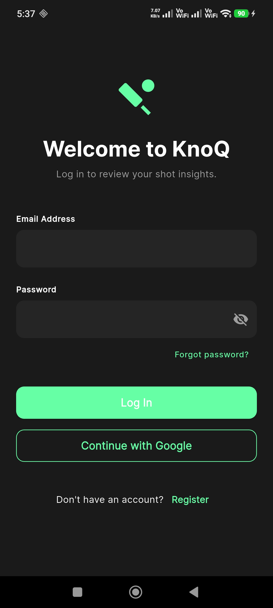
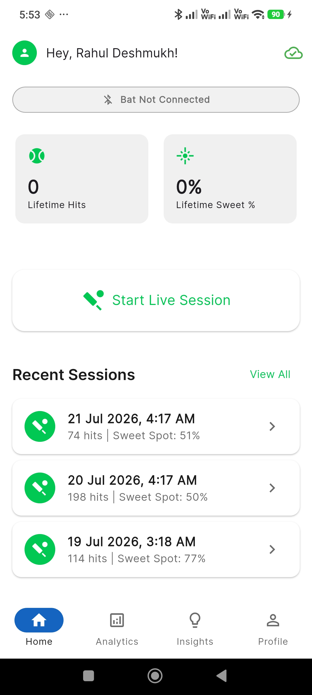
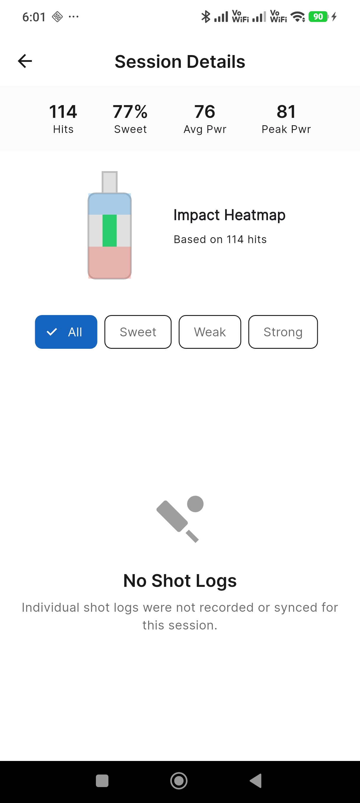
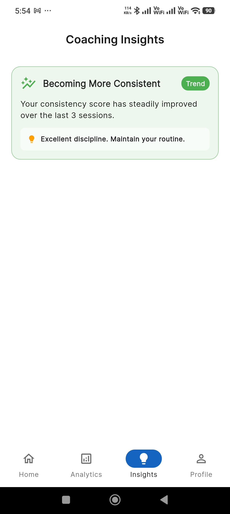
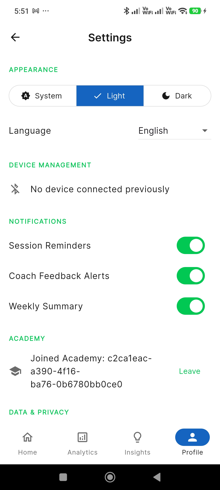
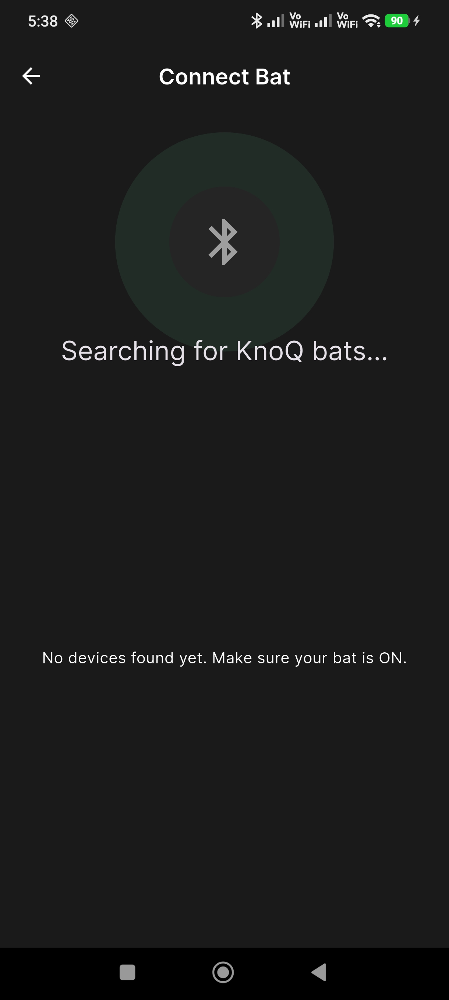

<p align="center">
  
</p>

<h1 align="center">KnoQ — Smart Cricket Bat</h1>

<p align="center">
  <strong>An IoT-Powered Cricket Training Platform with Real-Time Analytics & AI Coaching</strong>
</p>

<p align="center">
  
  
  
  
</p>

---

## 🏏 What is KnoQ?

**KnoQ** transforms an ordinary tennis cricket bat into an intelligent training partner. By embedding sensors directly inside the bat and connecting them to a powerful mobile + web analytics ecosystem, KnoQ gives every player access to professional-grade coaching insights — previously reserved for national-level academies.

> *"Data-driven coaching for every cricketer, from gully cricket to the academy."*

The system captures **real-time batting metrics** — swing speed, impact zone, power index, sweet spot accuracy — and streams them live to the player's smartphone via Bluetooth Low Energy (BLE). Coaches monitor their entire academy through a web dashboard with leaderboards, trend analytics, and AI-powered insights.

---

## 📸 Screenshots

### 📱 Mobile App (Flutter — Android)

<p align="center">
  
  &nbsp;&nbsp;
  
  &nbsp;&nbsp;
  
  &nbsp;&nbsp;
  
</p>

<p align="center">
  <em>Login → Player Dashboard → Session Details with Impact Heatmap → AI Coaching Insights</em>
</p>

<p align="center">
  
  &nbsp;&nbsp;
  
</p>

<p align="center">
  <em>Settings & Device Management → BLE Bat Connection</em>
</p>

---

### 🖥️ Web Dashboard (React + Vite)

<p align="center">
  
</p>
<p align="center"><em>Academy Overview — Players, Coaches, Sessions, Active Bats at a glance</em></p>

<p align="center">
  
</p>
<p align="center"><em>Analytics — Sessions per Day, Sweet Spot & Power Trends over 30 days</em></p>

<p align="center">
  
</p>
<p align="center"><em>Zone Distribution Donut Chart & Player Leaderboards</em></p>

<p align="center">
  
</p>
<p align="center"><em>Device Management — Battery, Firmware, Online Status</em></p>

---

### 🔩 Hardware Prototype

<p align="center">
  
</p>
<p align="center"><em>ESP32 microcontroller with piezoelectric impact sensors embedded inside a cricket bat</em></p>

---

## ✨ Key Features

### 🏏 For Players (Mobile App)
- **Live Session Mode** — Connect your KnoQ bat via Bluetooth and see real-time swing speed, power index, and impact zone as you play
- **Impact Heatmap** — Visual bat diagram showing where your shots are landing across the blade
- **Session History** — Browse past sessions with detailed stats: total hits, sweet spot %, avg power, peak power
- **AI Coaching Insights** — Automated trend detection ("Becoming More Consistent", "Power Improving")
- **Offline-First Architecture** — Sessions are saved locally and synced when connectivity returns
- **Crash Recovery** — Unsaved sessions are automatically recovered if the app crashes mid-practice
- **Demo Mode** — Try the full app experience without a physical bat

### 🎓 For Coaches & Academies (Web Dashboard)
- **Academy Overview** — Total players, coaches, sessions, lifetime shots, and active bats
- **Player Management** — Invite players, track individual progress, identify at-risk players
- **Advanced Analytics** — Sessions per day, sweet spot & power trends, zone distribution charts
- **Player Leaderboards** — Most improved, most consistent, most active, best sweet spot %
- **Device Fleet Management** — Track battery levels, firmware versions, online/offline status
- **Coach Notes** — Leave rich-text feedback on individual sessions for players to review
- **Drill System** — Assign targeted drills to players with automatic completion tracking
- **AI Lab** — Experimental AI-powered analysis tools
- **PDF Reports** — Download detailed analytics reports

### ⚡ Hardware (Smart Bat)
- **ESP32-WROOM-32** microcontroller with BLE connectivity
- **Piezoelectric disc sensors** for precise impact zone detection
- **MPU-9250 / BNO055 IMU** for swing speed and bat path tracking
- **LiPo battery** with USB-C charging
- **Real-time BLE streaming** at low latency

---

## 🏗️ System Architecture

```
┌─────────────────────────────────────────────────────────────────┐
│                        KnoQ PLATFORM                            │
├─────────────────────────────────────────────────────────────────┤
│                                                                 │
│  ┌──────────┐    BLE     ┌──────────────┐    HTTPS    ┌──────┐ │
│  │ Smart Bat │ ────────► │  Mobile App  │ ──────────► │ API  │ │
│  │ (ESP32)   │           │  (Flutter)   │             │Server│ │
│  └──────────┘            └──────────────┘             └──┬───┘ │
│   ↑ Sensors                ↑ Camera                      │     │
│   • Piezo (impact)         • Video Sync                  │     │
│   • IMU (motion)           • Offline Cache               ▼     │
│   • Battery                                         ┌────────┐ │
│                                                     │PostgreSQL│
│  ┌──────────────┐                                   └────────┘ │
│  │ Web Dashboard │ ◄─────── HTTPS ──────────────────► API      │
│  │ (React/Vite)  │                                             │
│  └──────────────┘                                              │
│                                                                 │
│  ┌──────────────┐                                              │
│  │   Firebase    │  Auth · Push Notifications · Storage         │
│  └──────────────┘                                              │
└─────────────────────────────────────────────────────────────────┘
```

---

## 💻 Technology Stack

| Layer | Technology | Details |
|-------|-----------|---------|
| **Firmware** | C++ (Arduino) | ESP32 sensor fusion, BLE GATT server |
| **Mobile App** | Flutter (Dart) | Riverpod state management, Hive offline storage, Go Router |
| **Web Dashboard** | React + TypeScript | Vite build, Recharts, TanStack Query |
| **Backend API** | Node.js + Express | RESTful API, JWT auth middleware |
| **Database** | PostgreSQL | Relational data: users, sessions, shots, academies |
| **Auth & Notifications** | Firebase | Authentication, Cloud Messaging (FCM) |
| **Communication** | Bluetooth Low Energy | Real-time sensor data streaming |

---

## 📁 Project Structure

```
KnoQ/
├── firmware/               # ESP32 Arduino firmware (C++)
│   └── knoq_bat/           # Sensor fusion, BLE GATT server
│
├── knoq_app/               # Flutter mobile application
│   └── lib/
│       ├── core/            # Shared widgets, themes, networking, constants
│       ├── features/        # Feature modules (auth, ble, session, analytics, coach)
│       ├── routing/         # Go Router configuration
│       └── services/        # Background sync, notifications
│
├── knoq-api/               # Node.js + Express backend
│   ├── routes/              # API endpoints (users, sessions, analytics, drills)
│   ├── middleware/          # Authentication, rate limiting
│   ├── jobs/                # Background jobs (clip extraction)
│   └── utils/               # FCM, helpers
│
├── knoq-dashboard/         # React + Vite web dashboard
│   └── src/
│       ├── components/      # UI components (charts, tables, modals)
│       ├── pages/           # Page views (Overview, Players, Analytics, AI Lab)
│       └── lib/             # API client, utilities
│
├── ai_data/                # AI/ML training data and models
├── docs/                   # Project documentation & design PDFs
├── images/                 # Screenshots and media
│   ├── mobile/             # Mobile app screenshots
│   ├── dahboard/           # Web dashboard screenshots
│   └── hardware/           # Hardware prototype photos
│
├── LICENSE                 # Proprietary license
└── README.md               # This file
```

---

## 🔧 Hardware Components

| Component | Specification | Purpose |
|-----------|---------------|---------|
| **MCU** | ESP32-WROOM-32 | Wi-Fi + BLE dual-mode microcontroller |
| **IMU** | MPU-9250 (9-axis) | Swing speed, bat path, follow-through tracking |
| **Impact Sensors** | 3× Piezoelectric discs (27mm) | Impact zone detection across the blade |
| **Power** | 400mAh LiPo + TP4056 | USB-C rechargeable, ~4 hours battery life |
| **Housing** | Custom-carved cavity in bat | Shock-isolated electronics compartment |

---

## 🚀 Getting Started

### Prerequisites

- **Node.js** v18+
- **Flutter** 3.x with Dart SDK
- **PostgreSQL** 14+
- **Firebase** project with Authentication enabled
- **Android Studio** or physical Android device

### Backend Setup

```bash
cd knoq-api
cp .env.example .env        # Configure database and Firebase credentials
npm install
npm run dev                  # Starts on port 3000
```

### Mobile App Setup

```bash
cd knoq_app
flutter pub get
flutter run                  # Connect Android device or emulator
```

### Web Dashboard Setup

```bash
cd knoq-dashboard
npm install
npm run dev                  # Starts on port 5173
```

### Seed Demo Data

```bash
cd knoq-api
node seed_visitor.js         # Creates demo academy, players, coaches, and sessions
```

---

## 🎮 Demo Mode

KnoQ includes a built-in **Demo Mode** for showcasing the app without requiring physical hardware:

1. Launch the mobile app
2. Tap **"Try Demo Mode"** on the login screen
3. You'll be logged in as a demo player with pre-loaded session history
4. In a Live Session, tap the **"Simulate Hit"** button to see real-time bat metrics in action

---

## 👥 Core Team

| Role | Name | Contribution |
|------|------|-------------|
| **Project Lead** | **Farhan Sayed** | Full-stack software development, hardware design & integration, system architecture, project management |
| **Software Developer** | **Viraj Dalvi** | Software development contributions |
| **Hardware Engineer** | **Harsh Khudtarkar** | Hardware prototyping and sensor integration support |

---

## 🎯 Target Audience

- 🏏 **Cricket academies** seeking data-driven training tools
- 🎓 **Coaches** who want objective metrics to track player progress
- ⚡ **Amateur players** practicing tennis cricket who want structured feedback
- 🏢 **Sports tech enthusiasts** interested in IoT + AI applications

---

## 🛣️ Roadmap

- [x] ESP32 firmware with BLE GATT server
- [x] Flutter mobile app with live session tracking
- [x] React web dashboard for coaches
- [x] Node.js API backend with PostgreSQL
- [x] Firebase authentication & push notifications
- [x] Offline-first architecture with sync queue
- [x] AI coaching insights engine
- [x] Demo mode for showcasing
- [ ] Video sync and clip extraction
- [ ] MediaPipe pose estimation integration
- [ ] Ball tracking from bowler-end camera
- [ ] AI-generated personalized coaching videos
- [ ] Pressure simulation mode (match scenarios)
- [ ] iOS release

---

## ⚠️ License

**This project is proprietary software.**

Copyright © 2026 Farhan Sayed & KnoQ Team. All rights reserved.

No part of this codebase, hardware designs, firmware, or documentation may be reproduced, distributed, or used without explicit written permission from the copyright holder. See [LICENSE](LICENSE) for full terms.

Unauthorized copying, modification, distribution, or use of this project — in whole or in part — is strictly prohibited and may result in legal action.

---

<p align="center">
  
  <br />
  <strong>Built with 🏏 for cricket lovers.</strong>
  <br />
  <sub>© 2026 KnoQ Team. All rights reserved.</sub>
</p>
